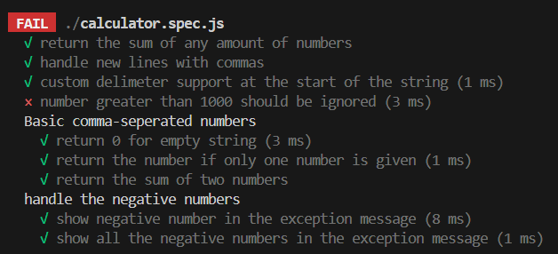
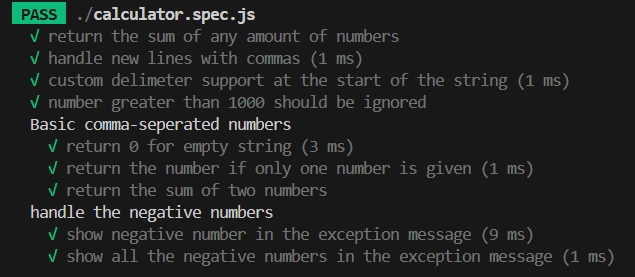

# String Calculator - TDD Kata

---

## Problem Statement

Create a method:

```js
add(string numbers) => int
```

It takes a string of numbers separated by delimiters and returns their sum.

---

## Features Implemented

-  Return `0` for an empty string
-  Return the number itself if only one number is provided
-  Return the sum of two or more comma-separated numbers
-  Support newline `\n` between numbers (`"1\n2,3"` → `6`)
-  Support custom delimiters (`"//;\n1;2"` → `3`)
-  Throw an exception when a negative number is included
-  Show **all negative numbers** in the exception message (`"negative numbers not allowed -1,-5"`)
-  Numbers which are greater than 1000 will be ignored (`"1000,1,1001"` → `1001`)

---

## TDD Workflow Followed

This project strictly follows the **Red–Green–Refactor** loop:

| Step         | Description                                    |
|--------------|------------------------------------------------|
| 🔴 Red        | Write a failing test case                     |
| 🟢 Green      | Write minimal code to make the test pass      |
| 🔁 Refactor   | Clean the code without changing behavior       |

Each step is committed separately to show the evolution of the solution.

---

##  Setup Instructions


### 1. Install Dependencies
```bash
npm install
```

### 2. Run Tests
```bash
npm run test
```

---

## Project Structure

```
string-calculator-tdd/
├── calculator.js         # Calculator logic
├── calculator.spec.js    # Jest test cases
├── package.json
└── README.md
└── screenshots
    └── test-fail.png
    └── test-pass.png
           
```

---

## Screenshots






---
